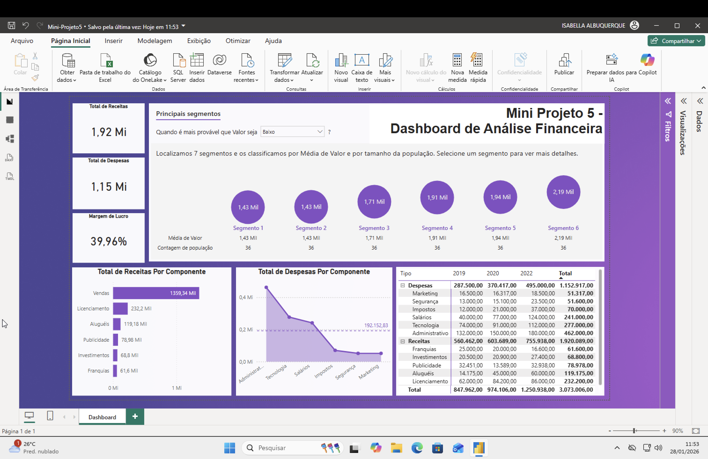

# Dashboard Análise Financeira 

# Objetivos 
Analisar os seguintes incicadores financeiros:
 - Total de Receitas
 - Total de Despesas
 - Margem de Lucro
 - Total de Receitas por Componente
 - Total de Despesas por Componente em Relação à Média de Despesas
 - Total de Receitas e Despesas por Componente e por Ano com Hierarquia Tipo/ Componente

# Fonte de Dados 
Dados Financeiros (XLSX)

# Tratamento de Dados 
- Padronização de categorias 
- Ajuste de tipos de dados 

# Métricas (DAX)
- Total de Receitas
- Total de Despesas
- Lucro
- Mergem de Lucro

# Visualizações 
- Cartões
- Gráfico de barras na horizontal
- Gráfico de área
- Matriz
- Principais influenciadores

# Screenshot

