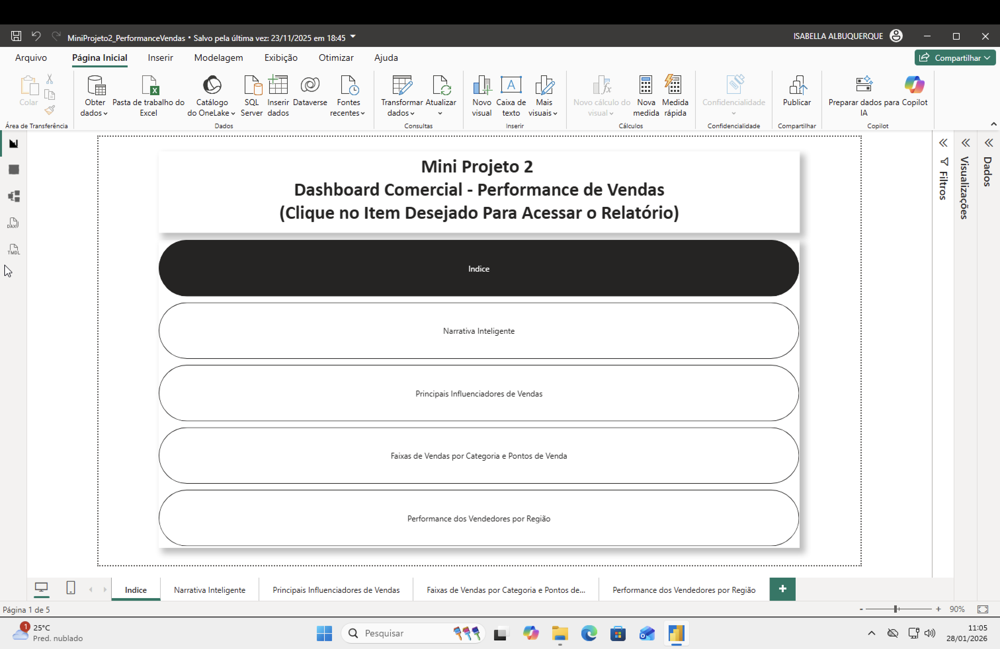
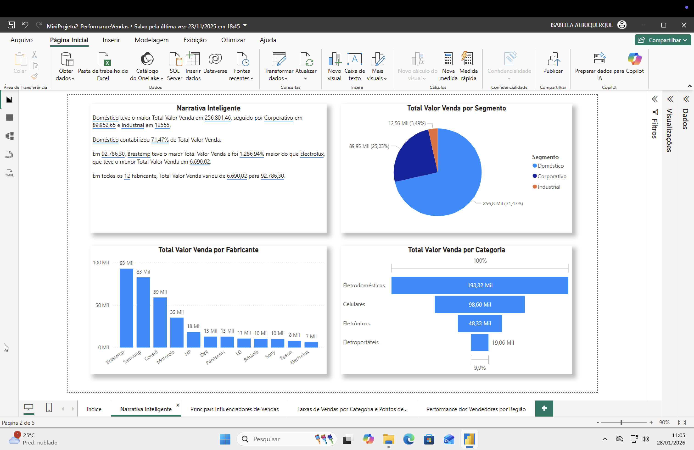
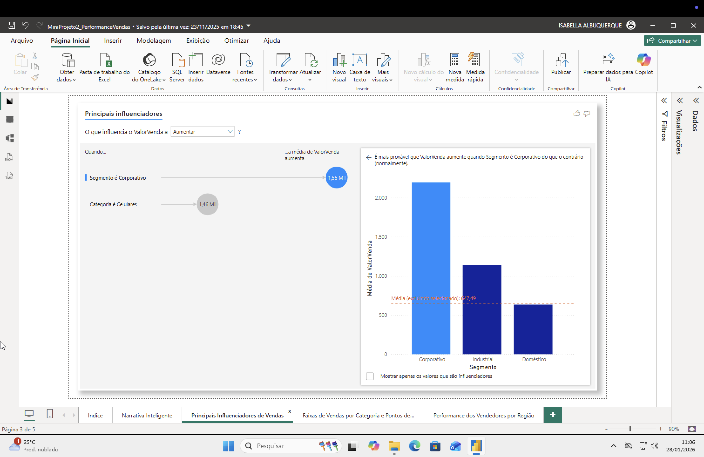
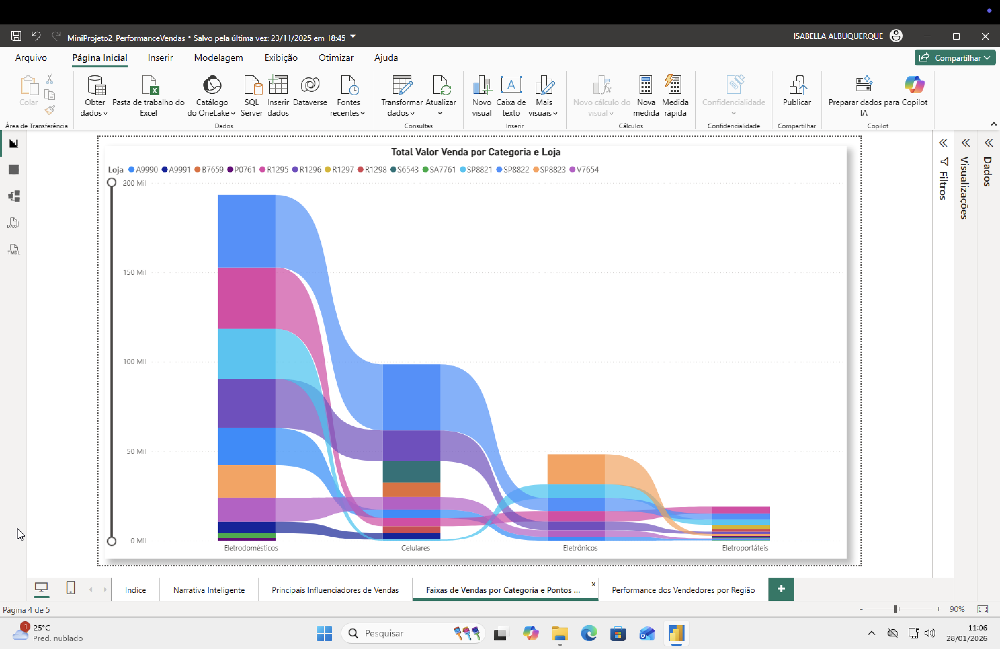
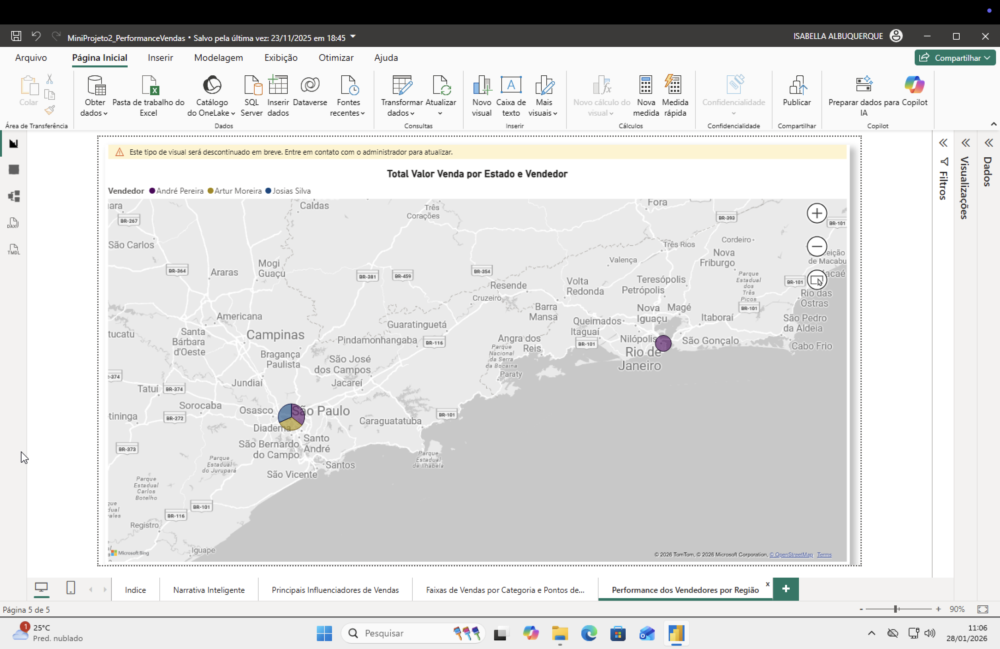

# Dashboard Comercial - Performance de Vendas

# Objetivo 
Construir diversas vizualizações para compreender a performance de valores de vendas por diferentes ângulos.
Divididos em 4 relatórios:
 - Narrativa Inteligente
 - Principais Influenciadores de Vendas
 - Faixas de Vendas por Categoria e Pontos de Venda
 - Performance dos Vendedores por Região

# Fontes de Dados
Dados Comerciais (xlsx)

# Visualizações 
 - Narrativa Inteligente:
   * Gráfico de pizza
   * Gráfico de barras
   * Funil
   * Narrativa inteligente

 - Pincipais Influenciadores de Vendas:
   * Principais influenciadores
     
 - Faixas de Vendas por Categoria e Pontos de Venda:
   * Gráfico de faixas
     
 - Performance dos Vendedores por Região:
   * Gráfico mapa

 - Índice

# Sreenshots

