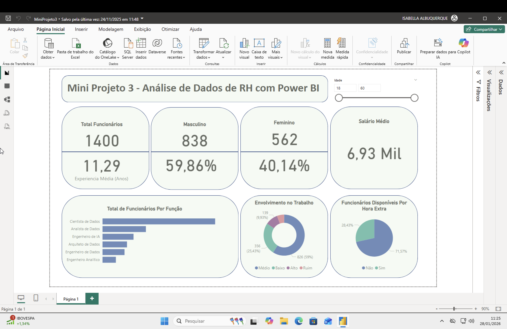

# Análise de Dados de RH

# Objetivo 
- Responder às perguntas:
 * Qual o total de funcionários na empresa?
 * Qual o tempo médio de experiência dos funcionários (em anos)?
 * Qual o total e percentual de funcionários do gênero masculino e feminino?
 * Qual a média salarial mensal?
 * Qual o total de funcionários por função?
 * Qual o percentual de funcionários disponíveis para fazer hora extra?
 * Qual o nível de envolvimento dos funcionários no trabalho considerando 4 categorias: Ruim, Baixo, Médio e Alto?

# Fontes de Dados
Data Set RH (CSV)

# Métricas (DAX)
- Total de Funcionários
- Total Feminino
- Total Masculino
- Porcentagem Feminino
- Porcentagem Maculino
- Salário Médio
- Total de Funcionários para Promover
- Total de Funcionários para Não Promover

# Visualizações 
- Cartões
- Gráfico de barras horizontal
- Gráfico de pizza
- Gráfico de rosca
- Segmentação

# Sreenshot

