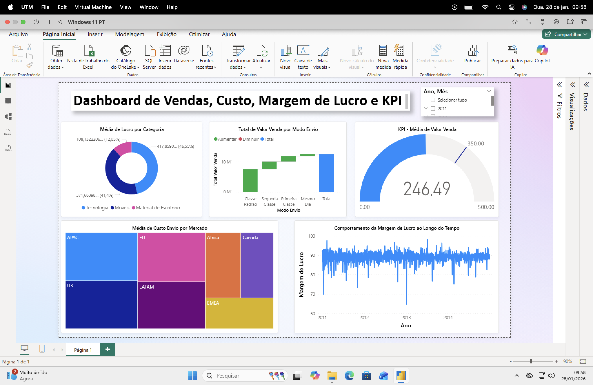

# Dashboard de Vendas, Custo, Margem de Lucro e KPI

# Objetivo 
Mostrar qual foi o total de valor venda considerando cada modo de envio dos pedidos, quais os mercados tiveram o maior custo médio de envio dos produtos, mostrar o KPI com o valor médio de venda, destacar qual categoria apresentou maior lucro médio e qual foi o comportamento da margem de lucro ao longo do tempo.

# Fonte de Dados
- Base de Vendas
- Base de Clientes
- Base de Pedidos
- Base de Produtos

# Tratamento de Dados 
- Padronização de categorias
- Criação e ajustes nos relacionamentos entre as tabelas

# Visualizações 
- Gráfico cascata
- Gráfico Treemap
- Gráfico de rosca
- Gráfico de linhas
- Indicador
- Segmentadores

# Sreenshots

